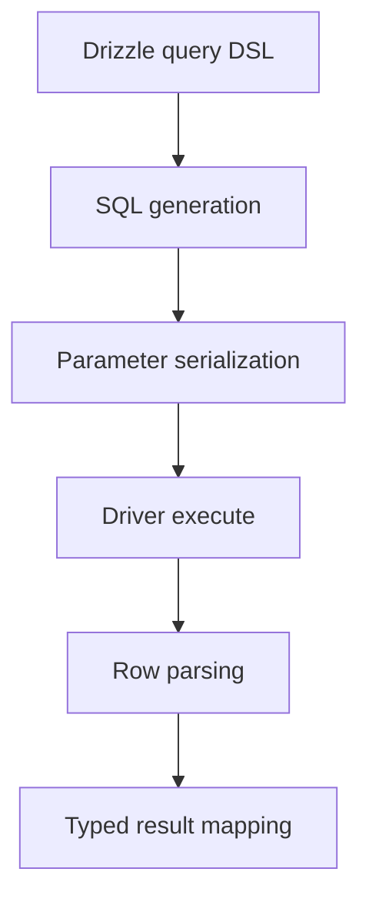
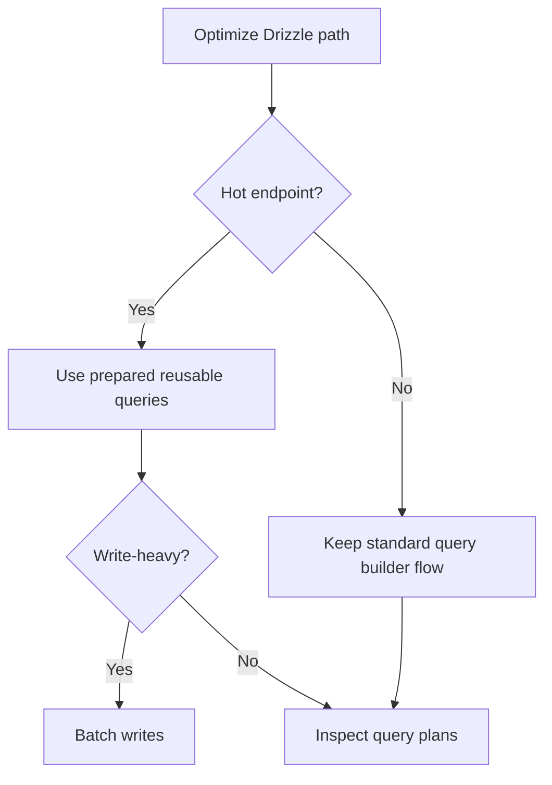

# Performance Guide

This document explains expected performance behavior for `drizzle-cubrid` and tuning patterns.

## Overview

`drizzle-cubrid` is a Drizzle ORM dialect layer on top of `cubrid-client`.

## Benchmark Results

Source: [cubrid-benchmark](https://github.com/cubrid-labs/cubrid-benchmark)

Environment: Intel Core i5-9400F @ 2.90GHz, 6 cores, Linux x86_64, Docker containers.

Driver baseline workload: TypeScript `cubrid-client` vs `mysql2`, 100 rows x 3 rounds.

| Scenario | CUBRID (cubrid-client baseline) | MySQL (mysql2) | Ratio (CUBRID/MySQL) |
|---|---:|---:|---:|
| insert_sequential | 6.18s | 14.85s | 0.4x |
| select_by_pk | 6.57s | 13.89s | 0.5x |
| select_full_scan | 5.60s | 14.71s | 0.4x |
| update_indexed | 6.32s | 14.87s | 0.4x |

Note: Drizzle adds query builder and mapping overhead on top of the driver baseline.

## Performance Characteristics

- Drizzle is designed for good performance with typed SQL generation and lean runtime behavior.
- Query builder composition still adds overhead compared to direct driver calls.
- Most overhead appears in SQL generation and result mapping, not in network transport.
- For hot paths, generated SQL shape stability improves plan/cache behavior.

## Optimization Tips

- Keep high-volume paths in prepared, reusable query functions.
- Use batched inserts/updates for write-heavy workloads.
- Avoid unnecessary joins/select columns in latency-sensitive endpoints.
- Profile generated SQL and verify index usage in CUBRID plans.

## Running Benchmarks

1. Clone `https://github.com/cubrid-labs/cubrid-benchmark`.
2. Start benchmark Docker services for CUBRID and MySQL.
3. Run the TypeScript driver baseline suite (`cubrid-client` vs `mysql2`).
4. Add Drizzle ORM scenarios using the same dataset shape for fair comparison.
5. Compare driver-only and ORM-layer timings to quantify abstraction overhead.

Use benchmark repo docs/scripts for the exact command matrix.
