# Product Requirements Document — drizzle-cubrid

## Overview

**drizzle-cubrid** is a Drizzle ORM dialect for the CUBRID relational database. It extends
Drizzle's `mysql-core` infrastructure to provide type-safe schema definitions, query building,
and migration support for CUBRID databases via the `cubrid-client` TypeScript driver.

- **Package**: `drizzle-cubrid`
- **Language**: TypeScript (ES2022+, strict mode)
- **License**: MIT
- **Version**: 0.1.0
- **Organization**: cubrid-labs

## Problem Statement

CUBRID is a production-grade relational database widely used in Korean government and enterprise
systems. While Drizzle ORM supports MySQL, PostgreSQL, and SQLite, there is no existing Drizzle
dialect for CUBRID. Developers using CUBRID must fall back to raw SQL or use legacy ORMs.

## Goals

1. **Full Drizzle ORM integration** — schema definitions, type-safe queries, relations
2. **CUBRID-specific features** — SET/MULTISET/SEQUENCE types, MERGE INTO, ON DUPLICATE KEY UPDATE
3. **Driver bridge** — wraps `cubrid-client` (`CubridClient`) into Drizzle's session/query system
4. **Transaction support** — full transaction lifecycle including nested savepoints (with CUBRID's no-RELEASE-SAVEPOINT limitation)
5. **Migration-ready** — compatible with `drizzle-kit` for schema generation
6. **Type safety** — full TypeScript generics, no `any` escapes
7. **95%+ test coverage** — offline unit tests, integration tests with Docker

## Non-Goals

- Connection pooling (responsibility of `cubrid-client` or user code)
- ORM-level caching (Drizzle provides this at the core level)
- Support for drivers other than `cubrid-client` (can be added later)
- Prisma or TypeORM integration

## Architecture

### Drizzle ORM Extension Model

```mermaid
flowchart TD
    A[drizzle-orm/mysql-core<br/>base dependency] --> A1[dialect.ts - MySqlDialect SQL generation]
    A --> A2[session.ts - Abstract session and transaction classes]
    A --> A3[db.ts - MySqlDatabase]
    A --> A4[table.ts - MySqlTable]
    A --> A5[columns/ - Column type definitions]
    A --> A6[query-builders/ - SELECT, INSERT, UPDATE, DELETE]

    B[drizzle-cubrid<br/>our package] --> B1[src/]
    B1 --> B11[index.ts - Public API exports]
    B1 --> B12[driver.ts - drizzle factory and driver]
    B1 --> B13[session.ts - Session, prepared query, transaction]
    B1 --> B14[columns.ts - mysql-core re-exports plus CUBRID columns]
    B1 --> B15[table.ts - cubridTable schema builder]
    B1 --> B16[types.ts - SET, MULTISET, SEQUENCE, MONETARY]
    B --> B2[tests/]
    B2 --> B21[session.test.ts - Session and transaction tests]
    B2 --> B22[driver.test.ts - drizzle factory tests]
    B2 --> B23[columns.test.ts - Column compilation tests]
    B2 --> B24[types.test.ts - Custom type tests]
    B2 --> B25[query.test.ts - Query builder integration tests]
    B2 --> B26[integration.test.ts - Live DB tests]
```



### How It Works

1. **User calls `drizzle(client)`** — creates `CubridDatabase` instance
2. **`CubridDatabase`** extends `MySqlDatabase` — gets all query builders for free
3. **`CubridSession`** extends `MySqlSession` — bridges `cubrid-client` queries
4. **`CubridPreparedQuery`** extends `MySqlPreparedQuery` — executes SQL via client.query()
5. **`CubridTransaction`** extends `MySqlTransaction` — uses begin/commit/rollback via client.transaction()
6. **`MySqlDialect`** is reused directly — CUBRID SQL is MySQL-compatible for most operations

## CUBRID vs MySQL Differences

| Feature | MySQL | CUBRID | Impact on Dialect |
|---------|-------|--------|-------------------|
| RETURNING | Supported | ❌ Not supported | Use `insertId` from result |
| BOOLEAN | Native | ❌ Maps to SMALLINT | Type mapping |
| JSON | Native | ❌ Not supported | Exclude JSON column type |
| ARRAY | ❌ | SET, MULTISET, SEQUENCE | Custom column types |
| AUTO_INCREMENT | ✅ | ✅ | Compatible |
| ON DUPLICATE KEY UPDATE | ✅ | ✅ | Compatible |
| MERGE INTO | ❌ | ✅ | Custom DML extension |
| REPLACE INTO | ✅ | ✅ | Compatible |
| Identifier case | Case-insensitive | Lowercase folding | Preparer adjustment |
| Max identifier length | 64 | 254 | Config adjustment |
| RELEASE SAVEPOINT | ✅ | ❌ | Skip in nested tx |
| Isolation levels | 4 | 6 | Custom isolation level type |
| Sequences | ✅ | ❌ (AUTO_INCREMENT only) | No sequence support |
| Paramstyle | `?` (positional) | `?` (positional) | Compatible |

## API Design

### Usage Example

```typescript
import { drizzle } from 'drizzle-cubrid';
import { createClient } from 'cubrid-client';
import { cubridTable, int, varchar, autoIncrement, primaryKey } from 'drizzle-cubrid';

// Define schema
const users = cubridTable('users', {
  id: int('id').autoincrement().primaryKey(),
  name: varchar('name', { length: 100 }).notNull(),
  email: varchar('email', { length: 255 }).notNull().unique(),
});

// Create client and drizzle instance
const client = createClient({
  host: 'localhost',
  port: 33000,
  database: 'testdb',
  user: 'dba',
});

const db = drizzle(client);

// Type-safe queries
const allUsers = await db.select().from(users);
const inserted = await db.insert(users).values({ name: 'John', email: 'john@example.com' });
await db.update(users).set({ name: 'Jane' }).where(eq(users.id, 1));
await db.delete(users).where(eq(users.id, 1));

// Transactions
await db.transaction(async (tx) => {
  await tx.insert(users).values({ name: 'Alice', email: 'alice@example.com' });
  await tx.insert(users).values({ name: 'Bob', email: 'bob@example.com' });
});

// Cleanup
await client.close();
```

### CUBRID-Specific Types

```typescript
import { cubridTable, set, multiset, sequence, monetary } from 'drizzle-cubrid';

const products = cubridTable('products', {
  id: int('id').autoincrement().primaryKey(),
  tags: set('tags', { type: 'varchar', length: 50 }),
  categories: multiset('categories', { type: 'varchar', length: 100 }),
  priceHistory: sequence('price_history', { type: 'numeric', precision: 10, scale: 2 }),
  price: monetary('price'),
});
```

## Dependencies

### Runtime
- `drizzle-orm` >= 0.38.0 (peer dependency)
- `cubrid-client` >= 0.1.0 (peer dependency)

### Development
- `typescript` ^5.7
- `vitest` ^3.0 (test runner)
- `tsup` ^8.0 (bundler)
- `eslint` + `@typescript-eslint` (linter)
- `c8` or vitest coverage (coverage)

## Quality Requirements

- **Test coverage**: ≥ 95% (CI-enforced)
- **TypeScript**: strict mode, no `any` escapes, no `@ts-ignore`
- **Linting**: ESLint with @typescript-eslint, no warnings
- **Build**: ESM + CJS dual output via tsup
- **CI**: GitHub Actions — lint + test on push/PR

## Versioning

Semantic versioning: `{major}.{minor}.{patch}`
- 0.1.0 — Initial release with core functionality
- 0.2.0 — CUBRID-specific types (SET, MULTISET, SEQUENCE)
- 0.3.0 — DML extensions (MERGE INTO, ON DUPLICATE KEY UPDATE)
- 1.0.0 — Stable release with full test coverage and documentation

## Success Criteria

1. `drizzle(client)` returns a fully functional database instance
2. All standard Drizzle queries work (SELECT, INSERT, UPDATE, DELETE)
3. Transactions with proper begin/commit/rollback semantics
4. CUBRID-specific column types compile to correct SQL
5. 95%+ test coverage with offline unit tests
6. Integration tests pass against CUBRID Docker container
7. Package builds cleanly as ESM + CJS
8. TypeScript strict mode with zero type errors

---

## Example-first Design Philosophy

### Why Example-first

CUBRID's ecosystem is small compared to PostgreSQL or MySQL. For a small-ecosystem
project, the entry barrier must be minimized — users should be able to copy-paste
working code within 30 seconds of reading the documentation.

> Because the ecosystem is still small, the project provides extensive examples
> and cookbook-style documentation to lower the adoption barrier.

### Hello World

```bash
npm install drizzle-cubrid drizzle-orm cubrid-client
```

```typescript
import { createClient } from 'cubrid-client';
import { drizzle } from 'drizzle-cubrid';
import { cubridTable, int, varchar } from 'drizzle-cubrid';

// Define schema
const users = cubridTable('users', {
  id: int('id').primaryKey().autoincrement(),
  name: varchar('name', { length: 100 }).notNull(),
  email: varchar('email', { length: 200 }).unique(),
});

// Connect
const client = createClient({
  host: 'localhost',
  port: 33000,
  database: 'demodb',
  user: 'dba',
});
const db = drizzle(client);

// Query
const allUsers = await db.select().from(users);
console.log(allUsers);

await client.close();
```

This code defines a typed schema, connects to CUBRID, and queries all users —
with full TypeScript type safety, no code generation, no configuration files.

### AI Agent Discoverability

Modern developers increasingly rely on AI coding assistants — Claude Code, OpenCode,
Cursor, GitHub Copilot, Devin, and others. These agents read README files, PRDs,
documentation, and example code to decide which libraries to recommend.

**More examples in documentation = higher probability of AI recommendation.**

By embedding working code directly in the PRD, README, and docs, we ensure that
AI agents can discover, learn, and recommend drizzle-cubrid accurately.

### Cookbook Integration

The [cubrid-cookbook](https://github.com/cubrid-labs/cubrid-cookbook) repository provides
production-ready, runnable examples for drizzle-cubrid:

| Example | Description |
|---|---|
| `node/drizzle/01_connect.js` | Connection + schema definition |
| `node/drizzle/02_crud.js` | Type-safe CRUD operations |
| `node/drizzle/03_transactions.js` | Transaction management |
| `node/drizzle/04_custom_types.js` | CUBRID-specific types (SET, MULTISET, SEQUENCE) |

### Inspiration from Successful Projects

Projects that succeeded partly through example-heavy documentation:

| Project | What They Did |
|---|---|
| **FastAPI** | Every endpoint documented with runnable examples; became the fastest-growing Python web framework |
| **LangChain** | Cookbook-first approach drove explosive adoption in the AI space |
| **SQLAlchemy** | Extensive ORM cookbook and tutorial; de facto Python ORM for 15+ years |
| **Pandas** | "10 Minutes to pandas" and cookbook lowered entry barrier for data science |

drizzle-cubrid follows the same philosophy: **examples are not supplementary — they are the primary documentation.**
